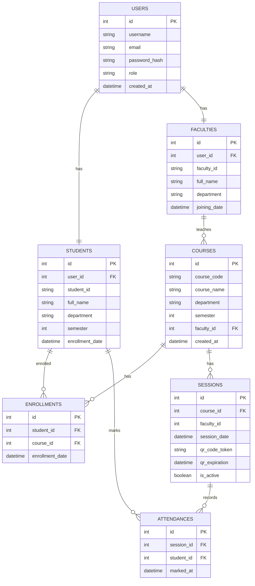

# Database Schema

## Entity Relationship Diagram

## Table Descriptions

### USERS Table
Stores basic user information for authentication.

**Fields:**
- `id`: Primary key
- `username`: Unique username for login
- `email`: User's email address
- `password_hash`: Hashed password
- `role`: User role (student, faculty, admin)
- `created_at`: Account creation timestamp

### STUDENTS Table
Stores student-specific information.

**Fields:**
- `id`: Primary key
- `user_id`: Foreign key to USERS table
- `student_id`: Unique student identifier
- `full_name`: Student's full name
- `department`: Academic department
- `semester`: Current semester
- `enrollment_date`: Date of enrollment

### FACULTIES Table
Stores faculty-specific information.

**Fields:**
- `id`: Primary key
- `user_id`: Foreign key to USERS table
- `faculty_id`: Unique faculty identifier
- `full_name`: Faculty member's full name
- `department`: Academic department
- `joining_date`: Date of joining the institution

### COURSES Table
Stores information about academic courses.

**Fields:**
- `id`: Primary key
- `course_code`: Unique course code
- `course_name`: Name of the course
- `department`: Academic department offering the course
- `semester`: Semester in which the course is offered
- `faculty_id`: Foreign key to FACULTIES table
- `created_at`: Course creation timestamp

### ENROLLMENTS Table
Tracks which students are enrolled in which courses.

**Fields:**
- `id`: Primary key
- `student_id`: Foreign key to STUDENTS table
- `course_id`: Foreign key to COURSES table
- `enrollment_date`: Date of enrollment

**Constraints:**
- Unique constraint on (student_id, course_id) to prevent duplicate enrollments

### SESSIONS Table
Stores attendance sessions with QR codes.

**Fields:**
- `id`: Primary key
- `course_id`: Foreign key to COURSES table
- `faculty_id`: ID of the faculty member creating the session
- `session_date`: Date and time of the session
- `qr_code_token`: Unique token for the QR code
- `qr_expiration`: Expiration time for the QR code
- `is_active`: Whether the session is currently active

### ATTENDANCES Table
Records student attendance for sessions.

**Fields:**
- `id`: Primary key
- `session_id`: Foreign key to SESSIONS table
- `student_id`: Foreign key to STUDENTS table
- `marked_at`: Timestamp when attendance was marked

**Constraints:**
- Unique constraint on (session_id, student_id) to prevent duplicate attendance marks

## Relationships

1. **One-to-One**: USERS to STUDENTS/FACULTIES (Each user has one profile)
2. **One-to-Many**: FACULTIES to COURSES (One faculty can teach multiple courses)
3. **Many-to-Many**: STUDENTS to COURSES through ENROLLMENTS (Students can enroll in multiple courses)
4. **One-to-Many**: COURSES to SESSIONS (One course can have multiple sessions)
5. **One-to-Many**: SESSIONS to ATTENDANCES (One session can have multiple attendance records)
6. **One-to-Many**: STUDENTS to ATTENDANCES (One student can have multiple attendance records)